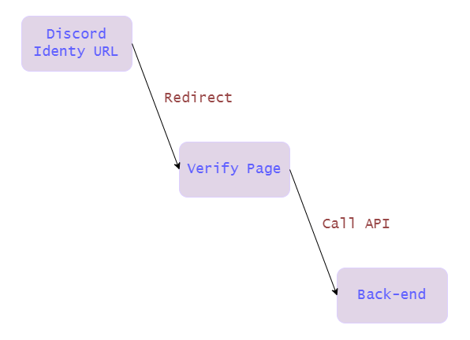
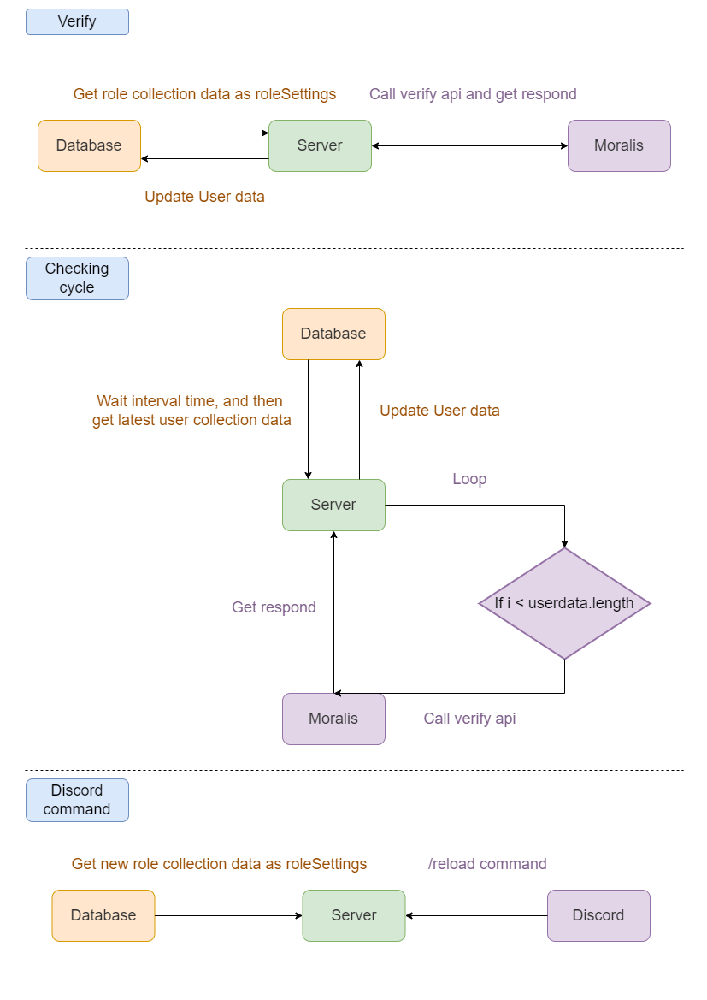
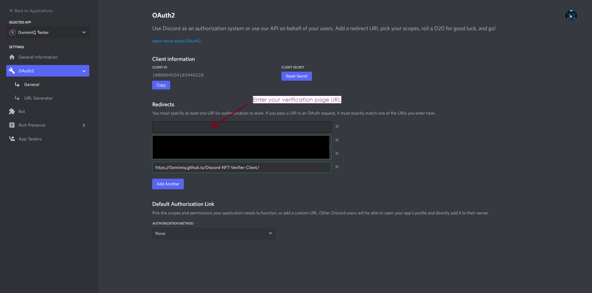
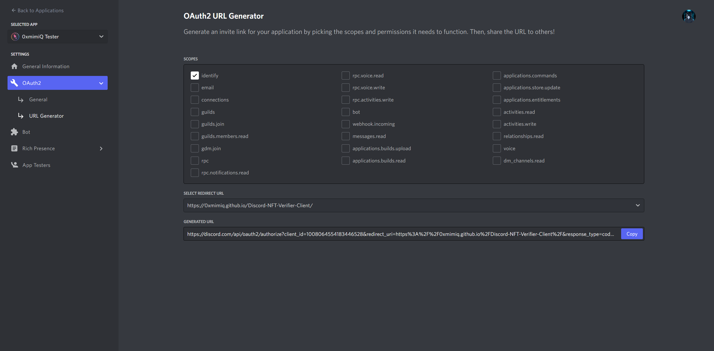
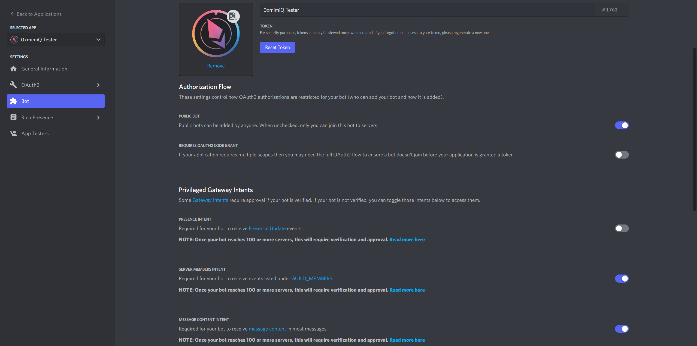
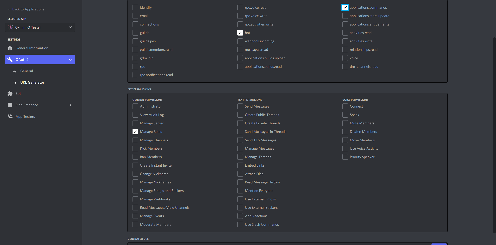

# Discord NFT Verifier - Client

<a href="https://github.com/0xmimiQ/Discord-NFT-Verifier-Server/blob/main/README.md"></a> &nbsp;<a href="https://github.com/0xmimiQ/Discord-NFT-Verifier-Server/blob/main/doc/README_CN.md"></a> &nbsp;<a href="https://github.com/0xmimiQ/Discord-NFT-Verifier-Server/blob/main/doc/README_JP.md"></a>

> Source code

- [**Client**](https://github.com/0xmimiQ/Discord-NFT-Verifier-Client)
- [**Server**](https://github.com/0xmimiQ/Discord-NFT-Verifier-Server)

<br />

> Overview

This bot provides NFT verification function. When the user is verified by the front-end, the user will get the corresponding role(s) set by the developer. The bot will be automatically verified once in a while. The relevant settings can be operated by the developer through local or cloud database, and this bot uses MongoDB - Atlas.

**※This bot does not work across multiple Discord Guild, but this part can be easily added by adding the guild id field of the role collection and modifying the related code.**

<br />

## Architecture & Technology

> Product Architecture and Related Technologies

### - Client

> Using: React + Tailwindcss

- The user is redirected to the front-end verification page of the service via the discord verification link, and once the wallet is linked, information is sent to the back-end waiting for the verification result. After receiving the result, the result will be displayed to the user.



<br />

### - Server

> Using: Express + MongoDB Atlas + DiscordJS

- After receiving user information from the front-end (discord-related and wallet address), \*calls Moralis API to confirm whether the user's wallet contains the token contract set by the developer, and decides whether to give the user role(s) according to the aforementioned.
- Verified user wallets are re-checked every cycle to determine whether to add or remove user role(s).
- Developers can change the role settings by modifying the database data.
- Provide Discord Slash Command(/reload) to load new role settings at any time.

**Parallel requests - Use parallel requests for speed. The free API has a limit of 25 requests per second, so if you are using the free API, please keep the number of contracts to 25 or less, otherwise you will have to modify the code yourself and split it into multiple groups to verify in batches.**



<br />

## Setup

> 1. Set the settings for the Discord robot. (※You must give this bot an role with higher privileges than the ones this bot can give, otherwise it will not work.)

### - Add Discord verification API redirect page (your verification system home page)



### - Select the URL of the verification page added above to generate a verification URL for users to use



Note that the `code` string in the generated url must be replaced with `token`.

### - Open the privileged gateway intents



### - Select the scopes and permissions to generate a bot invitation link and then invite the bot to your Guild



<br />

> 2. To set up the database, MongoDB - Atlas is used here.

### - To configure role

Create a collection with the name `role` under the database you want to use for the connection, and insert a document in the following form.

```json
{
  "tokenAddress": "0x0C5cEA99fEd27c98B505837A8E72cfDF70bcF8F0",
  "roles": [
    {
      "roleName": "Kaiju VIP", // Discord role name
      "roleId": "932197370173718578", // Discord role id
      "requiredAmount": {
        "$numberInt": "1"
      }
    },
    {
      "roleName": "Special Kaiju VIP",
      "roleId": "989098089216376832",
      "requiredAmount": {
        "$numberInt": "3"
      }
    }
  ]
}
```

<br />

When you want to add role(s) to an added contract, add json directly to the array in the following format.

```json
{
  "roleName": "role name",
  "roleId": "discord role id",
  "requiredAmount": {
    "$numberInt": ">=0 number"
  }
}
```

**After adding, remember to enter `/reload` in your Discord Guild to load the new settings, or restart the server.**

<br />

> 3. Create the client and server folders, then run `git clone` in each folder to copy the files from the repository, and then run the npm command. Finally, deploy the production environment through a reverse proxy server. You can also run `npm start` directly for testing purpose.

<br />

### - Client folder

```sh
mkdir <projectfolderForClient> && cd <projectfolderForClient>
git clone https://github.com/0xmimiQ/Discord-NFT-Verifier-Client
npm install
```

<br />

Change the `verifyApiUrl` in `./src/App.js` file with `verifyApiUrl` as your backend API Url.

```javascript
const verifyApiUrl = "verify.0xmimiq.me";
```

<br />

Then run：

```sh
npm run build
```

### - Server folder

```sh
mkdir <projectfolderForServer> && cd <projectfolderForServer>
git clone https://github.com/0xmimiQ/Discord-NFT-Verifier-Server
npm install
```

<br />

Change `./src/_configs.json` to `./src/configs.json`, and change the file parameters to your parameters:

```json
{
  "clientURL": "", // It's your verify page url
  "serverPort": 11111,
  "mongoDBUri": "mongodb+srv://<UserName>:<Password>@cluster0.badrclk.mongodb.net/<DatabaseName>",
  "discord": {
    "ownerId": "",
    "token": "",
    "guildId": "", // The bot is going to run discord guild id
    "logChannelId": "", // A log channel id in the guild above
    "checkUserCycleTime": 1200000 // Check wallet cycle interval time in ms
  },
  "moralis": {
    // Apply api key in https://moralis.io/
    "apiKey": "",
    "logLevel": "info",
    "formatEvmChainId": "decimal",
    "formatEvmAddress": "checksum"
  }
}
```

### - Set up reverse proxy server

Use a reverse proxy server such as [Nginx](https://www.nginx.com/) to set up the relevant parameters to run.

See how to deploy your files to Nginx:

- https://www.youtube.com/watch?v=6CjbezdbB8o
- https://help.clouding.io/hc/en-us/articles/4407785919762-How-to-Deploy-a-React-js-App-with-Nginx-on-Ubuntu-20-04

<br />

## Demo

> Verification page and updates in Discord

- [**Static verify page**](https://0xmimiq.github.io/Discord-NFT-Verifier-Client/)
- [**Discord demo**](./doc/img/discordDemo.png)

<br />

## Reference

### - Client

- [**React**](https://reactjs.org/)
- [**Tailwindcss**](https://tailwindcss.com/docs/installation)

### - Server

- [**ExpressJS**](https://github.com/expressjs/express)
- [**DiscordJS**](https://discord.js.org/#/docs/discord.js/main/general/welcome)
- [**MongoDB Atlas**](https://www.mongodb.com/docs/atlas/)
- [**Moralis**](https://moralis.io/)

<br />

## License

All artistic assets including but not limited to `Logo`, `Banner`, `Background` containing the following texts or related images are the property of `Kaiju of Cronos`, all rights reserved. Unauthorized use in its original form or reproduction is not allowed.

- Kaiju of Cronos
- クロノスの怪獣

For all other assets not restricted above, use [Apache-2.0 License](LICENSE).
